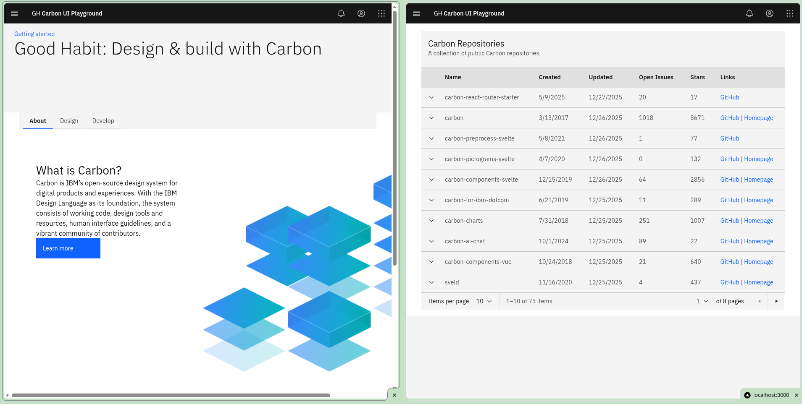

# Carbon UI + Next.js App

An example Next.js 13 application demonstrating the IBM Carbon Design System in React. It showcases a landing page built with Carbon components and a repositories page that fetches and displays public repositories from the `carbon-design-system` GitHub organization using Octokit.

## Overview

- Framework: Next.js 13 (App Router)
- UI: IBM Carbon Design System (`@carbon/react`, `@carbon/pictograms-react`)
- Data: GitHub REST API via `@octokit/core`
- Styling: Sass

## Features

- Home/Landing page with Carbon layout, tabs, and info cards.
- Repositories page that:
  - Calls GitHub API for `carbon-design-system` org repos.
  - Displays data in a Carbon `DataTable` with pagination.
  - Provides quick links to GitHub and project homepages.

## Getting started

Prerequisites: Node.js 16+ and Yarn.

Install dependencies:

```bash
yarn install
```

Run the development server:

```bash
yarn dev
```

Build for production:

```bash
yarn build
```

Start the production server:

```bash
yarn start
```

## Available scripts

- `yarn dev` — start Next.js in development mode
- `yarn build` — build the app
- `yarn start` — run the production build
- `yarn lint` — run Next.js ESLint
- `yarn format` — format code with Prettier
- `yarn format:diff` — list files that would be formatted

## Project structure

```
src/
  app/
    page.js            # Routes to the landing page
    home/page.js       # Landing page implementation
    repos/
      page.js          # Repositories listing (GitHub API via Octokit)
      RepoTable.js     # DataTable wrapper for repo rows
public/
  tab-illo.png         # Illustration used on the landing page
```

Key config files:

- `next.config.js` — Next.js configuration
- `jsconfig.json` — path aliases for `@/components/*` and `@/app/*`
- `package.json` — scripts and dependencies

## Notes

- The repos page makes unauthenticated requests to the GitHub API, which are rate‑limited. If you hit rate limits, consider authenticating Octokit.

## License

Licensed under the Apache-2.0 License. See the `license` field in `package.json`.
